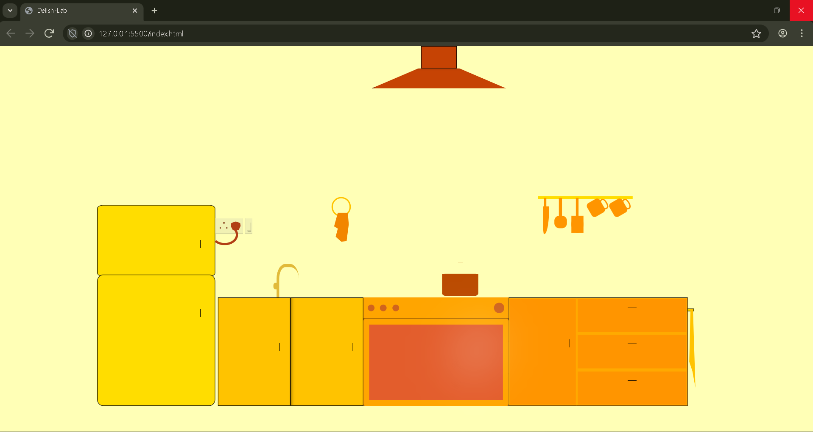

# 🍳 Delish Lab

An interactive 2D kitchen diorama built with HTML, CSS, and JavaScript.  
A personal project I built piece by piece while learning CSS, hehe.

**[Live](https://malar5717.github.io/delish-lab/)**

---

No frameworks, No libraries.
Just shapes (that transform), and warmth!